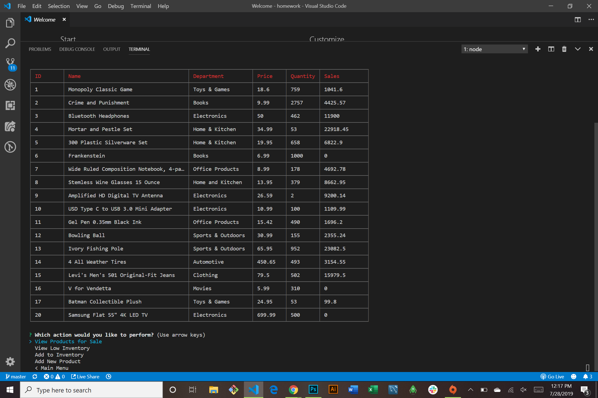

# Bamazon

### About this Project

This is a node app that allows users to view products stored on a local mySQL database. Customers can purchase items, view the amount ordered, and see their total price. Managers can view inventory and update inventory. Supervisors can view and update departments. Managers and Supervisors must enter 'password' in order to use the app. 

  **View Video Demo [Here!](https://www.youtube.com/watch?v=kf_w-kgh6QA)**

### Technologies used

* JavaScript
* Node.js
* mySQL
